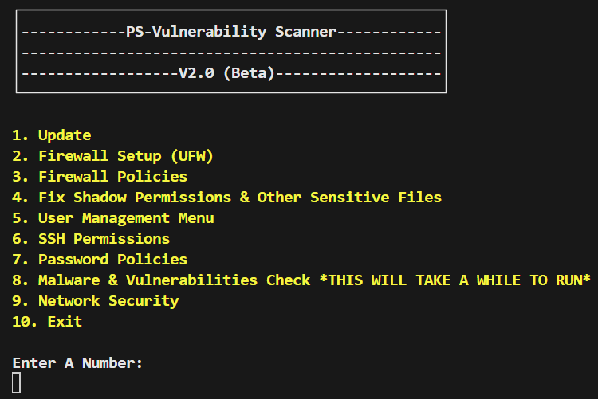

# PS-Hardening Script

**Version: 2.0 (Major Release)**

**Author:** Mitchell Meister (Linkedin: https://www.linkedin.com/in/mitchell-meister-04733b234/)

## Description

`PS-Hardening Script` (Previously Named pie.secure) is a Bash script designed to help secure your Ubuntu-based Linux system. It automates various security-related tasks, making it easier for users to enhance the security of their systems. pie.secure is perfect for cybersecurity competitions such as CCDC, CyberPatriot, and HiveStorm!

## Features 

1. **Update:** This option will update the system packages to the latest versions.
2. **Firewall Setup (UFW):** This option will set up and configure the Uncomplicated Firewall (UFW) to secure the system.
3. **Firewall Policies:** This option will configure specific firewall policies to control network traffic.
4. **Fix Shadow Permissions & Other Sensitive Files:** This option will ensure that the permissions of sensitive files like /etc/shadow are correctly set to prevent unauthorized access.
5. **User Management Menu:** This option provides a submenu for managing users, including adding/removing users, granting/revoking admin privileges, and securing the sudoers file.
6. **SSH Permissions:** This option will configure and secure SSH settings to prevent unauthorized access.
7. **Password Policies:** This option will configure password policies to enforce strong passwords.
8. **Malware & Vulnerabilities Check:** This option will run checks for malware and common vulnerabilities. It may take a while to complete.
9. **Network Security:** This option will configure network security settings to protect the system from network-based attacks.
10. **Search for Prohibited Files:** This option will search the system for files with specific extensions that are prohibited.

## User Management Security

The User Management Menu (Option 5) provides several functionalities to manage and secure user accounts:

1. **Add A User:** Allows the addition of a new user to the system.
2. **Remove A User:** Allows the removal of an existing user from the system.
3. **Remove A User Admin:** Revokes admin privileges from a user.
4. **Grant A User Admin:** Grants admin privileges to a user.
5. **Secure Sudoers File:** Ensures that only authorized users have sudo access and verifies the permissions of the sudoers file.
6. **Create a User Group:** Allows the creation of a new user group.
7. **Add Users To Group:** Adds a user to an existing group.



## Usage

1. Clone the repository to your local machine:

   ```bash
   git clone https://github.com/your-username/PS-Vulnerability-Scanner.git
   ```

2. Make the script executable:

   ```bash
   chmod +x script.sh
   ```

3. Run the script as a superuser (root):

   ```bash
   sudo ./script.sh
   ```

4. Follow the on-screen menu options to perform various security tasks.

## Important Notes

- **Use with caution:** This script makes significant changes to your system's configuration. Ensure you have a backup and understand the implications of each option.
- **Disclaimer:** The author is not responsible for any damage or issues that may occur as a result of running this script.

## License

This project is licensed under the [GPL 3.0 License].
